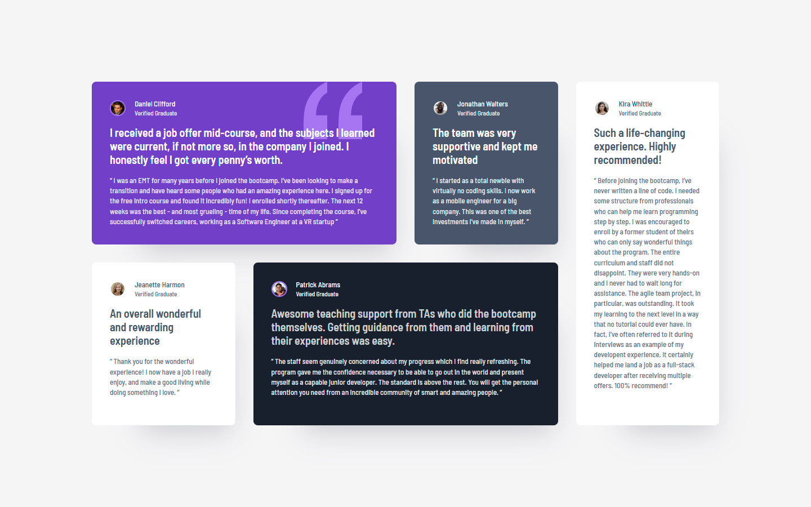

# Frontend Mentor - Testimonials grid section solution

This is a solution to the [Testimonials grid section challenge on Frontend Mentor](https://www.frontendmentor.io/challenges/testimonials-grid-section-Nnw6J7Un7). Frontend Mentor challenges help you improve your coding skills by building realistic projects. 

## Table of contents

- [Overview](#overview)
  - [The challenge](#the-challenge)
  - [Screenshot](#screenshot)
  - [Links](#links)
- [My process](#my-process)
  - [Built with](#built-with)
  - [What I learned](#what-i-learned)
  - [Continued development](#continued-development)
- [Author](#author)

## Overview

### The challenge

Users should be able to:

- View the optimal layout for the site depending on their device's screen size

### Screenshot

### Links

- Solution URL: [github.com/RicardoGeada/fm-testimonials-grid-section/](https://github.com/RicardoGeada/fm-testimonials-grid-section/)
- Live Site URL: [ricardogeada.github.io/fm-testimonials-grid-section/](https://ricardogeada.github.io/fm-testimonials-grid-section/)

## My process

### Built with

- [Angular](https://angular.dev/)
- CSS Grid
- SCSS
- Mobile-first workflow

### What I learned

This project helped deepen my understanding of CSS Grid, especially in building responsive layouts.

### Continued development

I aim to become more confident with CSS Grid and explore more advanced techniques in future projects.

## Author

- Website - [ricardogeada.com](https://www.ricardogeada.com)
- Frontend Mentor - [@RicardoGeada](https://www.frontendmentor.io/profile/RicardoGeada)
